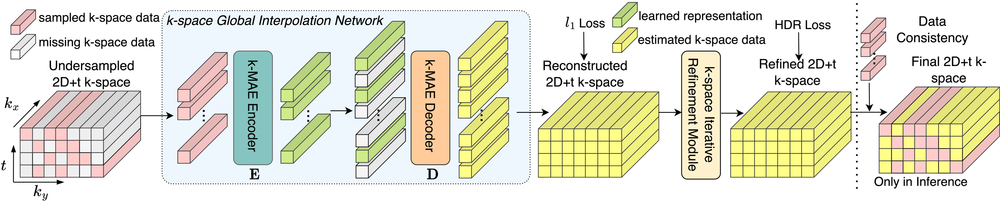

# Global k-Space Interpolation for Dynamic MRI Reconstruction using Masked Image Modeling
***
Jiazhen Pan, Suprosanna Shit, Özgün Turgut, Wenqi Huang, Hongwei Bran Li, Nil Stolt-Ansó, Thomas Küstner, Kerstin Hammernik and Daniel Rueckert.

Paper accepted at MICCAI 2023.

Please also refer to our [ArXiv paper](https://arxiv.org/abs/2006.06668).

For more details (video, poster etc.) please refer to our [project page](https://jzpeterpan.github.io/k-gin.github.io/).


Main Fig: The proposed k-space-based dynamic MR reconstruction framework consists of k-space Global Interpolation Network (k-GIN) and k-space Iterative Refinement Module (k-IRM) for refining the k-GIN interpolation. In the final
stage for the inference, we replace k-space estimation at the sampled position with ground-truth k-space values, ensuring the data consistency.

## Usage
Install environment and dependencies:
```python
conda create --name k_gin python=3.8
conda activate k_gin
pip install torch==1.13.0+cu116 torchvision==0.14.0+cu116 torchaudio==0.13.0 --extra-index-url https://download.pytorch.org/whl/cu116
pip install -r requirements.txt
```

To train the network: 
```python
python train.py --config config.yaml 
```
All the arguments and hyper-parameters can be adjusted in `config.yaml`. Since the applied data
of this work is confidential, users have to provide their own cardiac CINE data and undersampling 
masks. The corresponding data directory in `config.yaml` has to be uploaded accordingly.

## Citing 
If you find this code or data useful for your research, please consider citing the following paper:
```
@article{pan2023global,
        title={Global k-Space Interpolation for Dynamic MRI Reconstruction using Masked Image Modeling},
        author={Pan, Jiazhen and Shit, Suprosanna and Turgut, {\"O}zg{\"u}n and Huang, Wenqi and Li, Hongwei Bran and Stolt-Ans{\'o}, Nil and K{\"u}stner, Thomas and Hammernik, Kerstin and Rueckert, Daniel},
        journal={Medical Image Computing and Computer Assisted Intervention -- MICCAI 2023},
        year={2023}
      }
```
